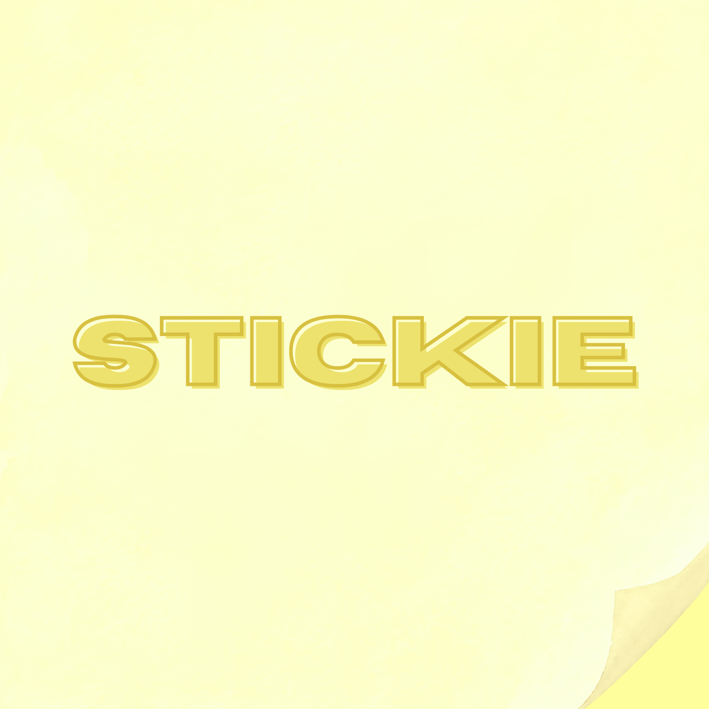
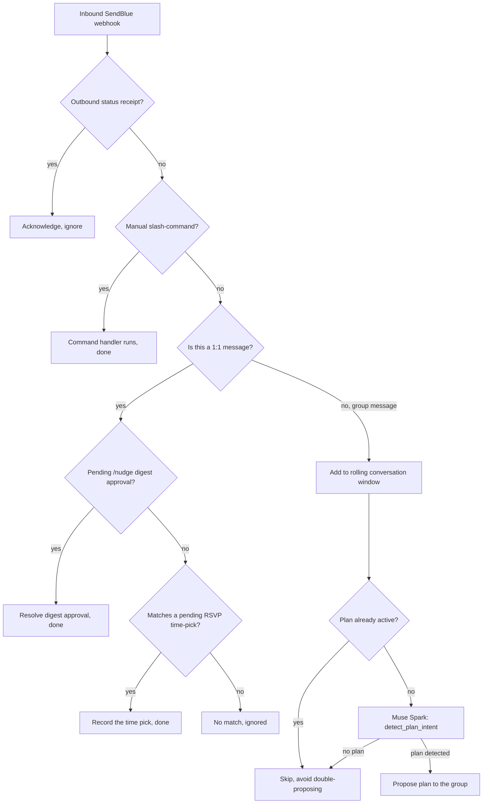

  

<h1 align="center">Stickie</h1>

<i>A friend texts "let's do this," everyone agrees, then nothing happens. Stickie locks the plan on everyone's calendar and nudges your crew back together before you drift apart, right from your texts.</i>

  
  
  
  
  
  
  
  
  
  
  
  

Built for HackGT 13, targeting Meta's "Bringing People Closer Together with AI" track and Aramco's "Social Good" track.

## Table of contents

- [The idea](#the-idea)
- [What it does](#what-it-does)
- [How AI is implemented](#how-ai-is-implemented)
- [Technical architecture](#technical-architecture)
- [Built with](#built-with)
- [Getting started](#getting-started)
- [Demo](#demo)
- [Challenges we ran into](#challenges-we-ran-into)
- [Accomplishments](#accomplishments)
- [What we learned](#what-we-learned)
- [What's next](#whats-next)

## The idea

We're a group that studied abroad together, made the promise every close friend group makes ("we're going to keep hanging out!"), and then watched real life happen anyway. Calendars filled up, everyone got busy, and every "we should do trivia," every "let's grab coffee" got a few reacts in the group chat and quietly died.

The flow is always the same: check everyone's calendar, agree on a place, follow up across a dozen texts. So we asked: what if the group chat itself could do that part? Not a new app to open, the exact thread everyone already has open all day.

## What Stickie does

Stickie has two real jobs: getting plans made, and keeping friendships from drifting.

**Making plans happen.** Someone in the group chat says "trivia this week?" and someone else says "I'm in." Stickie catches that, checks the Google Calendar of whoever has connected theirs, finds a real nearby venue through Google Places, and privately texts each person 1-2 times that actually work for them. The moment everyone's answered, it confirms in the group and drops the event onto every calendar.

**Keeping connections alive.** Stickie keeps a record of every friend you give it, people already on Stickie and your own contacts who aren't, logged the same way, with the last time you actually hung out. Text `/nudge` and it hands you back a list: everyone you're overdue to see, each with a plan already picked out. Reply "yes" to one and it sends that plan for you.

**Getting in takes zero downloads.** Text `/join`, or add the number straight to the group chat, and you're set. No app, it just lives in iMessage.

## How AI is implemented

Meta's Muse Spark model is the actual reasoning layer, called through `app/clients/muse_spark.py`, a thin `requests`-based wrapper around Muse Spark's OpenAI-Responses-API-shaped endpoint (`POST {base}/responses`, `input`/`output_text`). It's used 4 separate times in `app/reasoning.py`, each one a real judgment call, not a lookup:

| Function | What it decides |
|---|---|
| `detect_plan_intent` | Is a real plan actually forming in this group chat, or is it just chatter/a joke? |
| `interpret` | Which of the real options someone was asked about does an ambiguous reply like "eh, the other one" actually mean? |
| `generate_nudge_message` | Writes the nudge text a friend reads, so it reads like a person, not a notification |
| `suggest_activity_idea` | Powers `/ideas`: looks at a group's real stored interests and what they've actually confirmed doing, and proposes something new, unprompted |

Every one of those four functions calls Muse Spark first and falls back to a plain keyword heuristic if the call fails or times out, so a flaky network or an API hiccup degrades the feature instead of breaking the flow. `ask_muse_spark()` also runs its own circuit breaker (max 30 calls/minute, 1000/process) so a bug that causes a retry loop can't quietly burn through real API credit, it just trips the fallback instead.

## Technical architecture

Every real text, in the group or in any 1:1 thread, arrives through one webhook: `POST /webhook/sendblue`. It's checked in a strict order so nothing from one conversation ever gets misread as an answer to another:

**Backend module map** (`FastAPI/app/`):
- `main.py` — the webhook and its routing order above
- `reasoning.py` — the four AI functions plus their keyword fallbacks
- `clients/muse_spark.py` — the raw Muse Spark HTTP client and rate limiter
- `clients/sendblue.py` — sends/receives real iMessages
- `clients/google_calendar.py`, `clients/google_oauth_web.py`, `clients/places.py` — real calendar read/write, OAuth, and venue lookup
- `commands.py` — manual `/website`, `/plan`, `/join`, `/met`, `/ideas`, `/nudge`
- `planning.py` — propose → collect replies → confirm pipeline, with a real lock around finalizing a plan's time so two simultaneous replies can't corrupt it
- `crew_digest.py` — the unified `/nudge` digest + approval flow
- `mutual_mode.py` — tracks real hangouts between mutual Stickie friends
- `onboarding.py` — magic-link and 4-digit-code signup, Google OAuth callback
- `crew_routes.py` — REST API behind the dashboard's Crew tab
- `db.py` — `User`, `Contact`, `Interest`, `Plan`, `OnboardingToken`, `LastHangout`

**Frontend** (`Frontend/`): React + Vite + Tailwind, a companion dashboard nobody has to open to use Stickie, but it's there for anyone who wants to see their data, adjust their nudge cadence, or connect Google Calendar visually.

## Built with

| Layer | Stack |
|---|---|
| Backend | Python, FastAPI, SQLAlchemy |
| Database | PostgreSQL (hosted on Supabase) |
| Messaging | SendBlue (real iMessage send/receive) |
| AI | Meta Muse Spark |
| Calendar & places | Google Calendar API, Google Places API |
| Auth | Google OAuth 2.0 (web, PKCE) |
| Frontend | React, Vite, Tailwind CSS |
| Tunneling (dev) | Cloudflare Tunnel |

## Challenges we ran into

**Privacy.** Calendar connection is fully opt-in: if you haven't connected yours, Stickie just skips you instead of blocking the group. Every ask goes out one-on-one, so nobody's calendar, answer, or "no" is ever exposed to the whole group.

**Two people answering at the exact same time.** Once a plan's out to the group, more than one person can reply within the same second. We added a real lock around finalizing a plan's picked time, so whichever answer lands first is the one that sticks.

## Accomplishments

- A full working loop, tested live end to end: plan detected, real calendars checked, venue proposed, everyone confirms, event lands on every calendar automatically.
- Catching a genuinely new activity, nowhere in a hardcoded list, purely by understanding the conversation.
- One unified nudge list treating real Stickie friends and off-app contacts the same way.
- Four real, tested commands (`/join`, `/met`, `/ideas`, `/plan`) that each turn a whole flow into a single text.

## What we learned

- How to build a real agent that reads live messages and decides its own response, not a scripted bot.
- How to actually work with a live generative model in production, including real rate limits and opt-in requirements that only show up once real people are texting it.
- That real users break things a demo never does: a brand-new phone number, two people answering at once.
- How to collaborate under pressure, splitting work and fixing each other's bugs without stepping on each other's code.

## What's next

- Growing `/ideas` into an ongoing agent that keeps learning what a group actually likes over time.
- Extending Stickie to family relationships, a version of `/nudge` built for the people you're related to, not just the friends you hang out with.
- Real-time proximity nudges for when two friends are already out and nearby.
- Multi-platform gateways: WhatsApp, Discord, Telegram.
